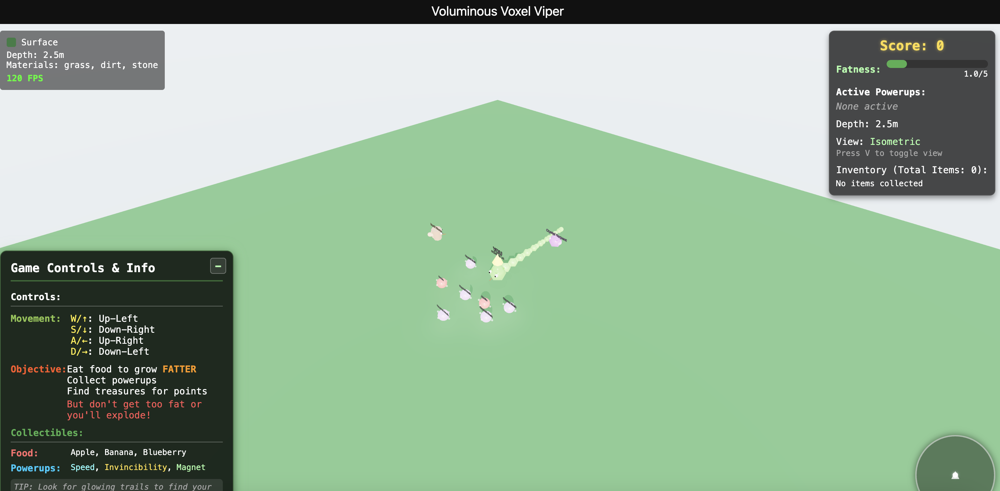

# 🐍 Voluminous Voxel Viper



## 🎮 Slither, Eat, Grow Fat, EXPLODE!

```
> be me
> fat snake
> slithering around in some weird grid world
> mfw apples keep spawning everywhere
> can't stop eating, getting fatter by the minute
> other snakes jealous of my gains
> hit 100 segments, still hungry
> game developer never implemented size limit
> one day special golden apple appears
> consume without hesitation
> immediate regret
> feel body expanding beyond grid boundaries
> explosion.exe
> bits of snake everywhere
> respawn as tiny snake
> see apple
> here we go again
```

## ✨ Epic Features

- 🐍 **Choose Your Chunky Viper**: 4 unique snake types with different fat-gaining potential - each with their own appetite and explosive limits!
- 👁️ **Dual Perspective**: Switch between immersive first-person and strategic isometric views with a tap
- 🍔 **Eat & Expand**: Consume everything you can find and watch your snake grow fatter with each bite
- 💎 **Treasure Hunter**: Collect rare minerals, magical power-ups, and delicious food that adds to your girth
- 🔦 **Dynamic Lighting**: Experience realistic shadows and glowing effects as your chunky friend slithers
- 🌐 **Procedural Generation**: Every game session offers a fresh buffet of collectibles
- 💥 **Explosive Gameplay**: Try to balance your snake's fatness level... or witness a gloriously messy explosion!
- 🎒 **Inventory System**: Track all the goodies you've consumed on your path to obesity

## 🚀 Quick Start

1. Clone the repository:
   ```bash
   git clone https://github.com/yourusername/voluminous-voxel-viper.git
   cd voluminous-voxel-viper
   ```

2. Install dependencies:
   ```bash
   npm install
   ```

3. Launch the game:
   ```bash
   npm run dev
   ```

4. Open [http://localhost:3000](http://localhost:3000) and start your adventure!

## 🎮 Controls

- **W/↑**: Move Up-Left
- **S/↓**: Move Down-Right  
- **A/←**: Move Up-Right
- **D/→**: Move Down-Left
- **V**: Toggle View Mode
- **Space**: Pause Game

## 🌎 Game Environment

Explore the colorful gaming arena:
- Track your **Fatness Level** carefully - it's your key to success and demise!
- Each food item increases your fatness
- At maximum fatness, your snake will explode in spectacular fashion
- Find special power-ups to gain temporary advantages
- Collect treasures for points and prestige (but watch your waistline!)

## 💎 Collectible Treasures

From common stones to legendary gems:
- **Food Items**: Apples, Blueberries, Bananas, Golden Apples, Crystal Fruit
- **Common**: Stone, Iron Ore, Copper Ore
- **Uncommon**: Silver Ore, Ancient Fossils
- **Rare**: Gold Nuggets, Emeralds, Rubies
- **Very Rare**: Diamonds, Magma Crystals

## 🐍 Choose Your Viper

Each snake has unique attributes:
- **Desert Sidewinder**: Fast and nimble with moderate fat gain
- **Cave Python**: High fat potential - perfect for players who like to live dangerously!
- **Jungle Viper**: Quick metabolism - can eat more before exploding
- **Magma Serpent**: Efficient fat converter - grows chunky quickly!

## 💻 Built With

- **Next.js** - React framework
- **Three.js** - 3D graphics library
- **React Three Fiber** - React renderer for Three.js
- **React Three Drei** - Useful helpers for React Three Fiber

## 🧠 Pro Tips

- 🔄 Toggle between view modes to get the best perspective for each situation
- 🦮 Watch out for AI snakes - they'll compete for food!
- 🧲 The Treasure Magnet power-up is extremely valuable for collecting distant items
- ⚡ Speed boosts help you navigate and collect food faster
- 🛡️ Invincibility lets you bash through obstacles
- 🎯 Use the minimap to track your position and plan your eating route
- 🍔 Keep an eye on your fatness meter - it's your life and death indicator!

---

## Get Ready to Slither, Gorge, and Explode!

Happy eating, gourmand! Can you collect the most treasures and score the highest points before your chunky snake meets its explosive demise?
